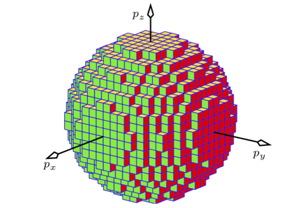

# Overview of ensembles
  

1. **Entropy as a function of microstate probabilities**:
 
   $$S = -k \sum_{i} p_i \log p_i$$

3. **Constraint imposed on thermodynamic coordinates to maintain constant values**:
   - Normalization of probabilities(all ensembles):
     
     $$\sum_{i} p_i = 1$$
     
   - Expected energy (for certain ensembles):
     
     $$\sum_{i} p_i E_i = \langle E \rangle$$
     
   - Expected number of particles (for certain ensembles):
     
     $$\sum_{N} p_N N = \langle N \rangle$$
     
   - Expected volume (for certain ensembles):
     
     $$\sum_{i} p_V V = \langle V \rangle$$

4. **Lagrange Multipliers**:
   Construct the Lagrangian with Lagrange multipliers} $\alpha$, $\beta$, ...
   
   $$L = -k \sum_{i} p_i \log p_i - \alpha \left( \sum_{i} p_i - 1 \right) - \beta \left( \sum_{i} p_i E_i - ...$$

### Finding maximum entropy solution with constraints (NVE example)

**Seek maximum of entropy**
    
   $$\frac{\partial L}{\partial p_j} = -k_B (\log p_j + 1) - \alpha  = 0$$

   $$p_j = e^{-\frac{\alpha}{k_B } - 1}$$

**Determine Lagrange multipliers**

   - Normalize $p_j$ to find $\alpha$:
     
     $$\sum_j p_j = \sum_j e^{-\frac{\alpha}{k_B} - 1} =\Omega$$
     
   - probabilities are independent of the microstate, and the sum can be set to be equal to a constant denoted as $\Omega$

**Probability Expression:**

  $$ p_j = \frac{1}{\Omega}$$

### Finding maximum entropy solution with constraints (NVT example)
    
   $$\frac{\partial L}{\partial p_j} = -k (\log p_j + 1) - \alpha - \beta E_j = 0$$

   $$p_j = e^{-\frac{\alpha}{k} - 1} e^{-\frac{\beta E_j}{k}}$$

**Determine Lagrange multipliers**

   - Normalize $p_j$ to find $\alpha$:
     
     $$e^{-\frac{\alpha}{k} - 1} = \frac{1}{Z}$$
   
     $$Z = \sum_{j} e^{-\frac{\beta E_j}{k}}$$

   - $\beta$ is typically identified with $\frac{1}{kT}$.

**Probability Expression:**

  $$ p_j = \frac{e^{-\frac{\beta E_j}{k}}}{Z}$$

## NVE Overview

### Thermodynamics

- **Fundamental relation**

$$dE = TdS-pdV+\mu dN$$

- **Derivatives of energy**

$$T = \Big(\frac{\partial E}{\partial S}\Big)_{V,N}\,\,\,\,\,\, p = -\Big(\frac{\partial E}{\partial V}\Big)_{S,N} \,\,\,\,\,\, \mu = \Big(\frac{\partial E}{\partial N}\Big)_{S,V}$$

- **Second law**

$$dS(E,V,N)\geq 0\,\,\,\,\,\,\,\,\, dE(S,V,N)\leq 0$$ 

### Statistical mechanics 

- **Bridge equation**

$$\Omega(N,V,E) = \sum^{}_{i} 1$$

$$S(N,V,E) = k_B log \Omega(N, V, E)$$

- **Probability of a microstate**

$$p(E) = \frac{1}{\Omega(N, V, E)}$$

- **Probability of a macrostate**

$$p(E_1, E-E_1) = \frac{\Omega(E_1) \Omega(E-E_1)}{\sum_{E_1} \Omega(E_1) \Omega(E-E_1)} = \frac{e^{S_1(E_1)+S_2(E-E_1)}}{e^{S(E)}}$$

## NVT Overview

### Thermodynamics

- **Fundamental relation**

$$dF = d(E-TS) = -SdT -pdV + \mu dN$$

- **Derivatives of free energy**

$$S = -\Big(\frac{\partial F}{\partial T}\Big)_{V,N}\,\,\,\,\,\, p = -\Big(\frac{\partial F}{\partial V}\Big)_{T,N} \,\,\,\,\,\, \mu = \Big(\frac{\partial F}{\partial N}\Big)_{T,V}$$

- **Second law**

$$dF(T,V,N)\leq 0$$ 

### Statistical mechanics

- **Bridge equation**

$$Z(N,V,T) = \sum^{}_{i} e^{-E_i/k_B T} = \sum_E \Omega(E) e^{-E/k_B T}$$

$$F=-k_BT log Z$$

- **Probability of a microstate**

$$p(E_i) = \frac{e^{-E_i/k_BT}}{Z}$$

- **Probability of a macrostate**

$$p(E') = \frac{\Omega(E^{'}) e^{-E^{'}/k_BT}}{Z} = \frac{e^{-\beta F^{'}}}{Z}$$

## $\mu$VT Overview

### Thermodynamics

- **Fundamental relation**

$$d\Phi_{\mu, T} = d(U-TS - \mu N) = -SdT-pdV-Nd\mu$$

- **Derivatives of free energy**

$$S = -\Big(\frac{\partial \Phi}{\partial T}\Big)_{V,N}\,\,\,\,\,\, p = -\Big(\frac{\partial \Phi}{\partial V}\Big)_{T,\mu} \,\,\,\,\,\, N = - \Big(\frac{\partial \Phi}{\partial \mu}\Big)_{T,V}$$

- **Second law**

$$d\Phi\leq 0$$

### Statistical mechanics

- **Bridge equation**

$$Z_G(\mu,V,T) = \sum^{}_{i, N} e^{-E_i/k_B T} \cdot e^{\mu N/k_B T} = \sum_E \Omega(E, N) e^{-E/k_B T} e^{\mu N/k_B T}$$

$$\Phi(\mu, V, T) =-k_BT log Z_G$$

- **Probability of a microstate**

$$p(E_i) = \frac{e^{-E_i/k_BT} e^{\mu N_i/k_BT}}{Z_G}$$

- **Probability of a macrostate**

$$p(E', N') = \frac{\Omega(E', N') e^{-E'/k_BT} e^{ \beta \mu N'}}{Z_G} = \frac{e^{-\beta \Phi'}}{Z_G}$$

## Ensemble equivalence

### Smallness of fluctuations

$$dU = SdT -VdP +\mu dN + BdM +... = \sum_i Y_i dX_i$$

Consider a conjucate pair of extensive $X_i$ and intensive $Y_i$ variables. For instnace $(1, E)$, $(S, T)$ or $(V, -p)$. The average and fluctuations of extensive variable $X$ for constant $Y$ is given by derivatives of parition function:

$$\langle X \rangle  = \frac{\partial log Z}{\partial \beta Y}$$

$$\sigma^2_X = \langle X^2 \rangle - \langle X \rangle^2  = \frac{\partial^2 log Z}{\partial (\beta Y)^2}$$

- **Smallness of fluctuations**

 $$\sigma^2_E = k_B T^2 C_v(T) $$

 $$\sigma^2_N = \frac{k_B T}{v} \kappa_T$$

### Legendre and Laplace transforms

Legendre transformation enables expressing the condition of equilibrium (e.g. maximium of entropy function) in terms of convenient variables (e.g minimum of some free eneergy function). 

- **Free energies are Legedre transforms of internal energy function $E(S,V,N,...)$**

$$\mathcal{L}_{S} E(S,V,N) = U - T\cdot S = F(N, V, T)$$ 

$$\mathcal{L}_{S, V} E(S,V,N) = U - T\cdot S + pV = G(N, p, T)$$

**General expression of Legendtre transform**

A general expression for legendre transform of energy $U(X_0, X_1, ...X_n, X_n+1, ... X_t)$ with respect to its extensive variables can be written down as:

$$\mathcal{L}_{X_{0}, ... X_{n}} U = U - \sum Y_k X_k = \Psi(Y_0,... Y_{n}, X_{n+1}, ...X_{t})$$

The various **partion functions** can then be seen to be of general form $e^{\beta \Psi}$ where the free energy function is a **Legendre transform over fluctuating quantities.**

$$Z(X_0, ... X_n | X_{n+1}, ... X_{t}) = exp \big(-\beta \mathcal{L_{X_{0}, ... X_{n}}} E (X_0, ... X_t) \big)$$

- Free energies as Laplace transform of internal energy function $E(S,V,N,...)$

$$Z(\beta, N, V) = e^{-\beta F(\beta, N, V)}$$

### Monoatomic ideal gas

**Quantum density of states of an ideal gas**

$$E({\bf n}) = \frac{h^2}{8mL^2} {\bf n^2}$$

$$\Omega(N,V, E) = \int_{E(n)=E} dn = \frac{C_{3N-1}}{2^{3N}} \int \delta \Big(\frac{(8mE)^{1/2}L}{h}-{\bf n}  \Big) d {\bf n}$$

- A sum over all total quantum number of N 3D particles in a box ends up being a problem of finding the volume of an N-dimensional sphere

**Classical density of states of an ideal gas**

$$H(p,q) =\frac{p^2}{2m} = E$$

$${\Omega(E) = \frac{1}{N! h^{3N}}\int_{p^N,q^N} dp^N dq^N \delta(H(p,q) -E) =\frac{V^N}{N! h^{3N}} \int dp^N \delta(p^2/2m -E)}$$

$$ \Omega(E) = \frac{V^N}{N! h^{3N}} \delta V(R)$$

Where $\delta V(R)$ is a volume of a spherical shell with radius $R = (2mE)^{1/2}$ and thickness $\delta R = 1/2 (2m/E)^{1/2} \delta E$

**Volume of a sphere in N dimesnional space**

$$V(R) = \frac{\pi^{D/2}}{(D/2)!} R^D$$

For $D\rightarrow \infty$ we discover that most of the volume of the sphere is concentrated at its surface!
 

$$\delta V(R) = V(R) -V(R-\delta R) = C [R^D - (R-\delta R)^D] = CR^D [1-(1- (\delta R/R)^D)] = CR^D = V(R)$$

### Classical density of states of an ideal gas

$$\boxed{\Omega(E) = \frac{V^N}{h^{3N} N!} \cdot \frac{(2m\pi E)^{3N/2}}{(3N/2)!}}$$
 
$$\boxed{ S = log \Omega(E) = k_B N \cdot  \Big [ log \Big(\frac{V}{N \lambda^3}\Big) + \frac{5}{2}\Big]}$$

- Note linear dependence on N. Entropy is an extensive quantity!

- exponent 3/2 reflexts that each particle has 3 degrees of freedom

- $\lambda = \Big(\frac{3h^2 N}{4\pi m E}\Big)^{1/2}$ thermal de Broglie wavelength.

- This result know as "Sackur Tetrode equation" was known long before statistical mechanics. 

#### Equations of state for ideal gas

$$\frac{1}{T} = \frac{\partial S}{\partial E} = \frac{3}{2}k_B \frac{N}{E}$$

 

$$\frac{p}{T} =  \frac{\partial S}{\partial V} = k_B N \frac{1}{V}$$

 

$$\frac{\mu}{T} = -\frac{\partial S}{\partial N} = k_B T \cdot log \frac{N}{V} \lambda^3$$

### Quasistatic process and Irreversibility

- From the NVE ensemble reasoning, we can now state that a quasistatic process corresponds to a process that does not change in the number of microstates. That is removal of a constraint keeps the "volume" of microstates intact.  

$$\Delta S = k_B log \frac{\Omega_f}{\Omega_i} = 0$$

- On the other hand, once the number of microstates grows upon removal of a constraint, then re-instating the constraint will not shrink the "volume" of microstate space. 

$$\Delta S = k_B log \frac{\Omega_f}{\Omega_i} > 0$$

### Thermal, Mechanical and chemical equilibrium

- The number of microstate for a system consisting of two parts can be written as a sum of all posisble energy partitionings among the two states. 

$$\Omega(E) = \sum_{E_1} \Omega_1(E_1) \Omega_2 (E-E_1) \approx \Omega_1(U_1) \Omega_2 (E-U_1)$$

- Since $\Omega(E)$ is a sharply increasing function of energy we expect the maximum term for some energy $E_1=U_1$  to dominate the sum. Let us find what state this maximum value should correspond to?

$$\frac{\partial log \Omega (E_1)}{\partial E_1} \Big |_{E_1=U_1}= \frac{\partial log\Omega_1(E_1)}{\partial E_1} - \frac{\partial log\Omega(E_2)}{\partial E_2}=0$$

#### Example: thermal contact between two ideal gases

Therefore for an ideal gas we will have:
