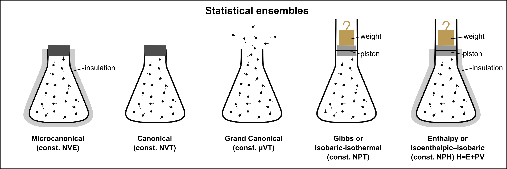

# Summary of Ensembles
  

## Entropy as a Function of Microstate Probabilities

Entropy is given by the **Shannon-Gibbs entropy formula**:

$$
S([p]) = -k_B \sum_{i} p_i \log p_i
$$

where $p_i$ is the probability of the $i$ th microstate.

### Physical Constraints for Equilibrium

For a system to maintain equilibrium values, the microstate probabilities must satisfy the following conditions:

1. **Normalization:**

   $$
   \sum_{i} p_i = 1
   $$

2. **Constraint to Maintain the Expectation Value of an Observable $X$ (e.g., Energy or Volume):**

   $$
   \sum_{i} p_i X_i = \langle X \rangle, \quad \sum_{i} p_i Y_i = \langle Y \rangle
   $$

   The probability of a macrostate $ (X, Y, \dots) $ follows the general form:

   $$
   P(X, Y, \dots) = \frac{e^{S(X, Y, \dots)/k_B - \beta (X + Y + \dots)}}{Z}
   $$

   where $Z$ is a normalization factor.

**Exponential dependence can be appreciated by considering exhcnage with environment or large reserovoir**

$$E_r\gg E,\quad V_r \gg V, \quad N_t \gg N$$

$$log \Omega_r(E_t-E, V_r-V, N_r-N,)\approx  const - \beta E + \beta\mu -\beta PV $$

$$P(E, N, V) \sim \Omega \cdot \Omega_r \sim e^{S(E, N, V)} \cdot e^{-\beta E} \cdot e^{\beta \mu N} \cdot e^{-\beta PV} $$

### **Comparison of Ensembles**

---

| **Ensemble** | **$ P(\text{microstate}) $** | **$ P(\text{macrostate}) $** |
|-------------|------------------------------------------------------|------------------------------------------------------|
| **Microcanonical (NVE)** | $ P(\text{microstate}) = \frac{1}{\Omega(E)} $ (all accessible microstates are equally probable) | $ P(E) \sim e^{S(E)/k_B} $ (entropy-dominated) |
| **Canonical (NVT)** | $ P(\text{microstate}) \sim e^{-\beta E} $ (Boltzmann distribution) | $ P(E) \sim e^{S(E)/k_B - \beta E} $ (entropy-weighted by energy) |
| **Grand Canonical (µVT)** | $ P(\text{microstate}) \sim e^{\beta (\mu N - E)} $ | $ P(N, E) \sim e^{S(N,E)/k_B + \beta (\mu N - E)} $ |
| **Isothermal-Isobaric (NPT)** | $ P(\text{microstate}) \sim e^{-\beta (E + PV)} $ | $ P(E, V) \sim e^{S(E, V)/k_B - \beta (E + PV)} $ |

---

**Key Highlights**
- **Entropy dependence** $e^{S/k_B}$ is universal across all ensembles.
- **Microstate probability** follows different forms based on constraints from different thermodynamic potentials.
- **Macrostate probability** always includes an entropy term but is modified by energy, pressure, and chemical potential, depending on the ensemble.

### **Extensive vs intensive variables**

- The total differential of internal energy $ U $ in a thermodynamic system can be expressed in terms of its conjugate variables:

$$
dU = SdT - VdP + \mu dN + BdM + \dots = \sum_i f_i dX_i
$$

- where each pair $(X_i, f_i)$ represents a conjugate extensive and intensive variable, such as:
  - $ (S, T) $ → entropy and temperature,
  - $ (V, -P) $ → volume and pressure,
  - $ (N, \mu) $ → particle number and chemical potential,
  - $ (M, B) $ → magnetization and magnetic field.

### **Laplace Transform and Ensemble Connections**

- The **Laplace transform** connects different thermodynamic ensembles by linking the **partition function** to energy and volume fluctuations. It effectively approximates a **Legendre transform** in the thermodynamic limit.

- **Canonical Ensemble (Energy Integration):**

  $$
  Z(\beta, N, V) = \int dE \, \Omega(E) e^{-\beta E} \approx e^{\min_E [S(E)/k_B - \beta E]}
  $$
  
  $$
  Z(\beta, N, V) = e^{-\beta [U - TS]} = e^{-\beta F(\beta, N, V)}
  $$

- **Isothermal-Isobaric Ensemble (Volume Integration):**

  $$
  Z(\beta, N, P) = \int dV \, Z(\beta, N, V) e^{-\beta P V} \approx e^{\min_V [F(V) - \beta P V]}
  $$

 
  $$
  Z(\beta, N, P) = e^{-\beta [U - TS - PV]} = e^{-\beta G(\beta, N, P)}
  $$

- Thus, **free energy functions naturally emerge as Legendre transforms of internal energy** through Laplace integration over fluctuating variables.

### **Legendre Transform and Thermodynamic Potentials**

- The **Legendre transformation** allows us to reformulate equilibrium conditions (e.g., **entropy maximization**) in terms of more convenient variables (e.g., **free energy minimization**). This introduces thermodynamic potentials suited to different ensembles.

#### **Free Energies as Legendre Transforms of Internal Energy**

- The internal energy function $ U(S, V, N, \dots) $ depends on **extensive** variables (e.g., entropy $ S $, volume $ V $, particle number $ N $). Thermodynamic free energies arise as **Legendre transforms** of $ U $ with respect to these variables:

- **Helmholtz Free Energy** (Legendre transform over $ S $):
  $$
  F(N, V, T) = U - T S = \mathcal{L}_{S} U(S, V, N)
  $$

- **Gibbs Free Energy** (Legendre transform over $ S, V $):
  $$
  G(N, P, T) = U - T S + P V = \mathcal{L}_{S, V} U(S, V, N)
  $$

- This transformation shifts from an **entropy-based** description to a **free-energy-based** description, making it possible to work with **temperature and pressure** as control variables instead of entropy and volume.

#### **Partition Functions and Legendre Transforms**

- The **partition function** naturally follows the structure of a **Legendre transform**, as it is related to free energy via:

$$
\Psi(f_1, \dots, f_{n}, X_{n+1}, \dots, X_{N}) = U(X_1, ... X_N) - (f_1 X_1+...f_nX_n)
$$

$$
Z(f_1, \dots, f_n, X_{n+1}, \dots, X_N) = e^{-\beta \Psi(f_1, \dots, f_{n}, X_{n+1}, \dots, X_{N})}
$$

- The $\Psi$ is a **thermodynamic potential** obtained through Legendre transformation of the internal energy.

### **Fluctuation-Response Relations**

- For a given extensive variable $ X $ and its conjugate intensive variable $ f $, the partition function $ Z $ governs both the **mean value** and **fluctuations** of $ X $. 

- **Mean value of $ X $ at constant $ f $:**

  $$
  \langle X \rangle = \frac{\partial \log Z}{\partial (\beta f)}
  $$

- **Fluctuations of $ X $ at constant $ Y $:**

  $$
  \sigma^2_X = \langle X^2 \rangle - \langle X \rangle^2 = \frac{\partial^2 \log Z}{\partial (\beta f)^2}
  $$

- This relation shows that fluctuations in $ X $ are directly linked to the second derivative of the partition function, a fundamental result of statistical mechanics.

#### **Energy fluctuations (Canonical Ensemble):**

  $$
  \sigma^2_E = k_B T^2 C_V
  $$

- where $ C_V $ is the heat capacity at constant volume.

####  **Particle number fluctuations (Grand Canonical Ensemble):**
 
  $$
  \sigma^2_N = k_B T \frac{\kappa_T}{V}
  $$

- where $ \kappa_T $ is the isothermal compressibility.

#### Key Insights

- **Fluctuations decrease as system size increases**, typically scaling as $1/\sqrt{N}$.
- **Response functions (e.g., heat capacity, compressibility) determine fluctuation magnitude**.
- **Ensemble equivalence** ensures that for large systems, different ensembles (canonical, grand canonical, etc.) give equivalent macroscopic results, despite differing fluctuation magnitudes.
