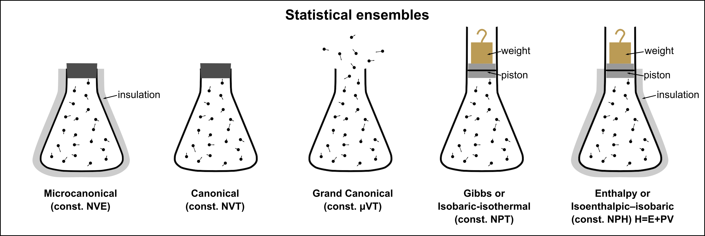
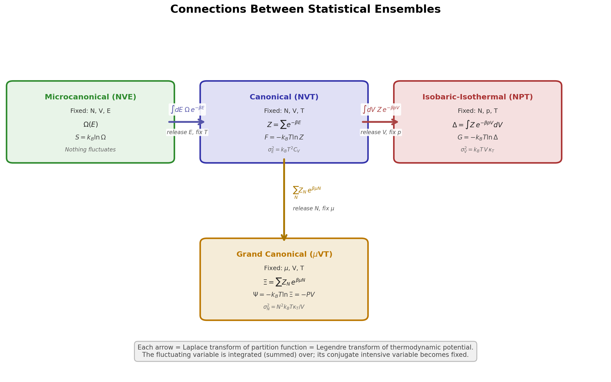

# Summary of Ensembles

## The Big Picture: Why Multiple Ensembles?

- All ensembles describe the **same macroscopic physics** in the thermodynamic limit. They differ only in which quantities are held fixed and which are allowed to fluctuate. The choice of ensemble is a choice of **boundary conditions:** what the system exchanges with its surroundings:

$$
\text{NVE} \xrightarrow{\text{allow } E \text{ to fluctuate}} \text{NVT} \xrightarrow{\text{allow } V \text{ to fluctuate}} \text{NPT}
$$

$$
\text{NVT} \xrightarrow{\text{allow } N \text{ to fluctuate}} \mu\text{VT}
$$

- Each arrow corresponds to placing the system in contact with a reservoir that controls the corresponding intensive variable ($T$, $p$, or $\mu$). Mathematically, each step is a **Laplace transform** of the partition function and a **Legendre transform** of the thermodynamic potential.

## Entropy and the Origin of Ensemble Distributions

Entropy is given by the **Shannon-Gibbs entropy formula**:

$$
S([p]) = -k_B \sum_{i} p_i \log p_i
$$

where $p_i$ is the probability of the $i$th microstate.

### Physical Constraints for Equilibrium

For a system to maintain equilibrium values, the microstate probabilities must satisfy the following conditions:

1. **Normalization:**

   $$
   \sum_{i} p_i = 1
   $$
2. **Constraint to Maintain the Expectation Value of an Observable $X$ (e.g., Energy or Volume):**

   $$
   \sum_{i} p_i X_i = \langle X \rangle, \quad \sum_{i} p_i Y_i = \langle Y \rangle
   $$

- The probability of a macrostate $ (X, Y, \dots) $ follows the general form:

  $$
  P(X, Y, \dots) = \frac{e^{S(X, Y, \ldots)/k_B} \cdot e^{- \beta X} \cdot e^{- \gamma Y}\cdots}{Z}
  $$

  $$
  Z(\beta, \gamma, \ldots) = \sum_{X, Y, \ldots} e^{S(X, Y, \ldots)/k_B}\, e^{- \beta X}\,  e^{- \gamma Y}\cdots
  $$
- Where $Z$ is a normalization factor called **partition function**
- **Exponential dependence** can also be understood as a consequence of exchange of (energy, volume, particles, etc.) with a large reservoir:

$$
E_r\gg E,\quad V_r \gg V, \quad N_r \gg N
$$

$$
\log \Omega_r(E_t-E,\, V_r-V,\, N_r-N)\approx  \text{const} - \beta E  -\beta PV + \beta \mu N
$$

$$
P(E, N, V) \sim \Omega \cdot \Omega_r \sim e^{S(E, N, V)/k_B} \cdot e^{-\beta E} \cdot e^{\beta \mu N} \cdot e^{-\beta PV}
$$

## Comparison of Ensembles

---

| **Ensemble**                    | **Fixed** | **Fluctuating** | **Partition Function**           | **Thermodynamic Potential** |
| ------------------------------------- | --------------- | --------------------- | -------------------------------------- | --------------------------------- |
| **Microcanonical (NVE)**        | $N, V, E$     | —                    | $\Omega(E)$                          | $S = k_B \ln \Omega$            |
| **Canonical (NVT)**             | $N, V, T$     | $E$                 | $Z = \sum e^{-\beta E}$              | $F = -k_BT \ln Z$               |
| **Isothermal-Isobaric (NPT)**   | $N, p, T$     | $E, V$              | $\Delta = \int Z\, e^{-\beta pV} dV$ | $G = -k_BT \ln \Delta$          |
| **Grand Canonical ($\mu$VT)** | $\mu, V, T$   | $E, N$              | $\Xi = \sum Z_N\, e^{\beta \mu N}$   | $\Psi = -k_BT \ln \Xi = -PV$    |

---

| **Ensemble**                    | **$ P(\text{microstate}) $**   | **$ P(\text{macrostate}) $**                                |
| ------------------------------------- | -------------------------------------- | ------------------------------------------------------------------- |
| **Microcanonical (NVE)**        | $ P_i = \frac{1}{\Omega(E)} $        | $ P(E) \sim e^{S(E)/k_B} $ (entropy-dominated)                    |
| **Canonical (NVT)**             | $ P_i \sim e^{-\beta E_i} $          | $ P(E) \sim e^{S(E)/k_B - \beta E} $ (entropy-weighted by energy) |
| **Isothermal-Isobaric (NPT)**   | $ P_i \sim e^{-\beta (E_i + PV)} $   | $ P(E, V) \sim e^{S(E, V)/k_B - \beta (E + PV)} $                 |
| **Grand Canonical ($\mu$VT)** | $ P_i \sim e^{\beta (\mu N - E_i)} $ | $ P(N, E) \sim e^{S(N,E)/k_B + \beta (\mu N - E)} $               |

---

- **Entropy dependence** $e^{S/k_B}$ is universal across all ensembles.
- **Microstate probability** follows different forms based on constraints from different thermodynamic potentials.
- **Macrostate probability** always includes an entropy term but is modified by energy, pressure, and chemical potential, depending on the ensemble.

## Extensive vs Intensive Variables

- The total differential of internal energy $ U $ in a thermodynamic system can be expressed in terms of its conjugate variables:

$$
dU = TdS-pdV + \mu dN + BdM + \dots = \sum_i f_i dX_i
$$

- where each pair $(X_i, f_i)$ represents a **conjugate extensive and intensive variable** respectively, such as:

  - $ (S, T) $ — entropy and temperature,
  - $ (V, -P) $ — volume and pressure,
  - $ (N, \mu) $ — particle number and chemical potential,
  - $ (M, B) $ — magnetization and magnetic field.
- **Key principle:** each ensemble is obtained by replacing one or more extensive natural variables of $U$ with the conjugate intensive variable. The reservoir fixes the intensive variable; the extensive variable fluctuates.

## Laplace Transform and Ensemble Connections

- The **Laplace transform** connects different thermodynamic ensembles by integrating (summing) over a fluctuating extensive variable, weighted by the Boltzmann factor of the conjugate intensive variable. In the thermodynamic limit, the saddle-point approximation turns the Laplace transform into a **Legendre transform**.
- **NVE $\to$ NVT (integrate over energy):**

  $$
  Z(\beta, N, V) = \int dE \, \Omega(E)\, e^{-\beta E} \approx e^{\max_E [S(E)/k_B - \beta E]}
  $$

  $$
  Z(\beta, N, V) = e^{-\beta [U - TS]} = e^{-\beta F(\beta, N, V)}
  $$
- **NVT $\to$ NPT (integrate over volume):**

  $$
  \Delta(\beta, N, P) = \int dV \, Z(\beta, N, V)\, e^{-\beta P V} \approx e^{\max_V [-\beta F(V) - \beta P V]}
  $$

  $$
  \Delta(\beta, N, P) = e^{-\beta [U - TS + PV]} = e^{-\beta G(\beta, N, P)}
  $$
- **NVT $\to$ $\mu$VT (sum over particle number):**

  $$
  \Xi(\beta, \mu, V) = \sum_{N=0}^{\infty} Z(\beta, N, V)\, e^{\beta \mu N} \approx e^{\max_N [-\beta F(N) + \beta \mu N]}
  $$

  $$
  \Xi(\beta, \mu, V) = e^{-\beta [U - TS - \mu N]} = e^{-\beta \Psi(\beta, \mu, V)} = e^{\beta PV}
  $$
- Thus, **free energy functions naturally emerge as Legendre transforms of internal energy** through Laplace integration over fluctuating variables.

## Legendre Transform and Thermodynamic Potentials

- The **Legendre transformation** allows us to reformulate equilibrium conditions (e.g., **entropy maximization**) in terms of more convenient variables (e.g., **free energy minimization**).
- This transformation makes it possible to work with **temperature and pressure** as control variables instead of entropy and volume.
- **Free Energies as Legendre Transforms of Internal Energy:**

| **Potential**      | **Legendre transform** | **Natural variables** | **Total differential**   |
| ------------------------ | ---------------------------- | --------------------------- | ------------------------------ |
| Internal energy$U$     | —                           | $S, V, N$                 | $dU = TdS - pdV + \mu dN$    |
| Helmholtz$F$           | $U - TS$                   | $T, V, N$                 | $dF = -SdT - pdV + \mu dN$   |
| Enthalpy$ H$           | $U + PV$                   | $S, P, N$                 | $dH = TdS + VdP + \mu dN$    |
| Gibbs$  G$             | $U - TS + PV$              | $T, P, N$                 | $dG = -SdT + VdP + \mu dN$   |
| Grand potential$ \Psi$ | $U - TS - \mu N$           | $T, V, \mu$               | $d\Psi = -SdT - pdV - Nd\mu$ |

### Partition Functions and Legendre Transforms

- The **partition function** naturally follows the structure of a **Legendre transform**, as it is related to the thermodynamic potential via:

$$
\Psi(f_1, \dots, f_{n}, X_{n+1}, \dots, X_{N}) = U(X_1, \ldots, X_N) - (f_1 X_1+\cdots+f_nX_n)
$$

$$
Z(f_1, \dots, f_n, X_{n+1}, \dots, X_N) = e^{-\beta \Psi(f_1, \dots, f_{n}, X_{n+1}, \dots, X_{N})}
$$

- The $\Psi$ is a **thermodynamic potential** obtained through Legendre transformation of the internal energy.

## Fluctuation-Response Relations

- For a given extensive variable $ X $ and its conjugate intensive variable $ f $, the partition function $ Z $ governs both the **mean value** and **fluctuations** of $ X $.
- **Mean value of $ X $ at constant $ f $:**

  $$
  \langle X \rangle = \frac{\partial \log Z}{\partial (\beta f)}
  $$
- **Fluctuations of $ X $ at constant $ f $:**

  $$
  \sigma^2_X = \langle X^2 \rangle - \langle X \rangle^2 = \frac{\partial^2 \log Z}{\partial (\beta f)^2}
  $$
- This relation shows that fluctuations in $ X $ are directly linked to the second derivative of the partition function, a fundamental result of statistical mechanics.

### Energy fluctuations (Canonical Ensemble):

$$

$$

  \sigma^2_E = k_B T^2 C_V

$$

$$

- where $ C_V $ is the heat capacity at constant volume.

### Volume fluctuations (Isothermal-Isobaric Ensemble):

$$

$$

  \sigma^2_V = k_B T\, V\, \kappa_T

$$

$$

- where $ \kappa_T = -\frac{1}{V}\left(\frac{\partial V}{\partial p}\right)_T $ is the isothermal compressibility.

### Particle number fluctuations (Grand Canonical Ensemble):

$$

$$

  \sigma^2_N = \frac{\langle N \rangle^2 k_B T \kappa_T}{V}

$$

$$

### Unified pattern

| **Ensemble** | **Fluctuating variable** | **Response function** | **Fluctuation formula**                |
| ------------------ | ------------------------------ | --------------------------- | -------------------------------------------- |
| NVT                | Energy$E$                    | Heat capacity$C_V$        | $\sigma_E^2 = k_BT^2 C_V$                  |
| NPT                | Volume$V$                    | Compressibility$\kappa_T$ | $\sigma_V^2 = k_BT\, V\, \kappa_T$         |
| $\mu$VT          | Particle number$N$           | Compressibility$\kappa_T$ | $\sigma_N^2 = \frac{N^2 k_BT \kappa_T}{V}$ |

### Key Insights

- **Relative fluctuations decrease as system size increases**, typically scaling as $\sigma_X/\langle X \rangle \sim 1/\sqrt{N}$.
- **Response functions (e.g., heat capacity, compressibility) determine fluctuation magnitude**. Large response $\Leftrightarrow$ large fluctuations.
- **Ensemble equivalence** ensures that for large systems, different ensembles give equivalent macroscopic results, despite differing fluctuation magnitudes. This is precisely because relative fluctuations vanish as $N \to \infty$.
- Near **phase transitions**, response functions diverge ($C_V \to \infty$, $\kappa_T \to \infty$), and fluctuations become macroscopically large — this is when ensemble equivalence can break down.
